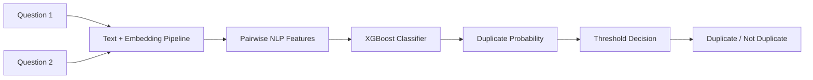
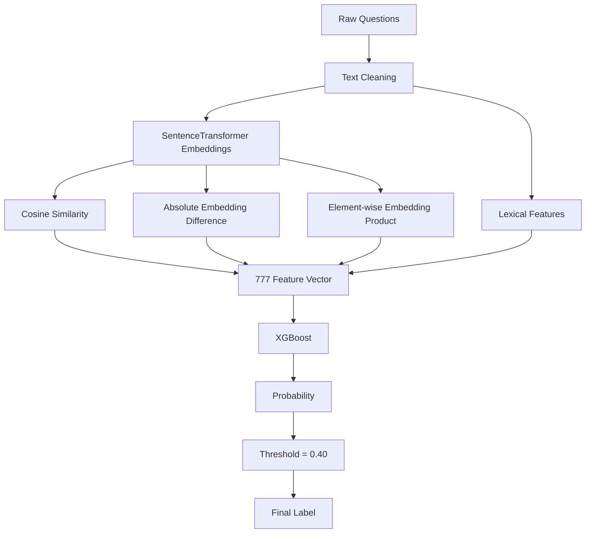

# Quora Duplicate Question Detector


An improved end-to-end NLP application that detects whether two questions are duplicates using sentence embeddings, engineered similarity features, a trained XGBoost classifier, and an upgraded Streamlit interface.

Built and improved by **Mohammed Ghanim Siddiqui**.

---

## Project Snapshot

| Area | Details |
| --- | --- |
| Problem | Detect whether two questions have the same meaning |
| Use cases | Quora duplicate detection, FAQ deduplication, support-ticket clustering, semantic search |
| Core model | XGBoost classifier over 777 pairwise NLP features |
| Embeddings | `all-MiniLM-L6-v2` SentenceTransformer |
| Modern NLP option | BGE sentence embeddings and optional Quora cross-encoder scoring |
| Interface | Streamlit web app with single, batch, and modern NLP modes |
| Best threshold | `0.40` |
| Test F1 | `0.8041` |

---

## Demo Flow



Example:

| Question 1 | Question 2 | Output |
| --- | --- | --- |
| How can I learn Python quickly? | What is the fastest way to learn Python? | Duplicate |

---

## What Makes This Version Better

This repository is an improved version of the original project. The codebase was refactored, the Streamlit app was redesigned, and modern NLP scoring options were added.

| Original | Improved Version |
| --- | --- |
| One large Streamlit file | Modular Python package |
| Loose dependencies | Version-pinned requirements |
| Basic UI | Cleaner app with validation and clearer outputs |
| Runtime path issues | Artifact paths resolved from project root |
| Duplicate embedding calls | Reused feature outputs |
| Notebook-heavy workflow | Added repeatable v2 training pipeline |
| Only saved XGBoost path | Added modern embedding and cross-encoder comparison |

---

## Application Features

### Single Prediction

Score one pair of questions using the saved trained classifier.

- Duplicate probability
- Final label
- Applied threshold
- Confidence band
- Cosine similarity
- Jaccard similarity
- Token overlap details

### Modern NLP

Compare questions using transformer-native semantic similarity.

- Fast bi-encoder embedding similarity
- Optional cross-encoder pair classification
- Embedding distance
- Lexical similarity diagnostics

### Batch Prediction

Upload a CSV with:

```text
question1,question2
```

The app validates the file, scores all rows, summarizes duplicate rate, and lets you download predictions.

---

## Project Structure

```text
quora_duplicate_detector_improved/
|
|-- README.md
|-- ML_PIPELINE_V2.md
|-- MODERN_NLP_UPGRADE.md
|-- artifacts/
|   |-- metadata.json
|   `-- quora_duplicate_classifier.joblib
|
|-- streamlit_interface/
|   |-- app.py
|   |-- requirements.txt
|   `-- quora_duplicate_detector/
|       |-- config.py
|       |-- paths.py
|       |-- text_features.py
|       |-- features.py
|       |-- inference.py
|       |-- model_assets.py
|       |-- modern_nlp.py
|       |-- features_v2.py
|       |-- evaluation.py
|       `-- training_v2.py
|
|-- Training_phase_with_GPU/
`-- *_Project_Quora_Duplicate_Question_Detection.ipynb
```

---

## Machine Learning Pipeline

The saved production path uses pairwise feature engineering:



Feature groups:

| Feature Group | Count |
| --- | ---: |
| Cosine similarity | 1 |
| Lexical features | 8 |
| Absolute embedding difference | 384 |
| Element-wise embedding product | 384 |
| Total | 777 |

---

## Model Metrics

| Metric | Score |
| --- | ---: |
| Accuracy | 0.8402 |
| Precision | 0.7347 |
| Recall | 0.8879 |
| F1 Score | 0.8041 |
| ROC-AUC | 0.9269 |

---

## Tech Stack

| Category | Tools |
| --- | --- |
| Language | Python |
| App | Streamlit |
| NLP | Sentence Transformers, HuggingFace Transformers |
| ML | Scikit-learn, XGBoost |
| Data | Pandas, NumPy |
| Training utilities | Threshold tuning, model benchmarking, v2 feature schema |

---

## Setup

Clone the repository:

```bash
git clone https://github.com/MOHAMMED-GHANIM-SIDDIQUI/quora-duplicate-detector-improved.git
cd quora-duplicate-detector-improved
```

Create and activate a virtual environment:

```bash
python -m venv .venv
.venv\Scripts\activate
```

Install dependencies:

```bash
pip install -r streamlit_interface/requirements.txt
```

Run the app:

```bash
streamlit run streamlit_interface/app.py
```

Then open:

```text
http://localhost:8501
```

For the full local transformer/XGBoost app, install the full dependency set and run:

```bash
pip install -r streamlit_interface/requirements-full.txt
streamlit run streamlit_interface/full_app.py
```

---

## Batch CSV Format

```csv
question1,question2
How can I learn Python quickly?,What is the fastest way to learn Python?
How do I learn machine learning?,What are the best tourist places in Nepal?
```

---

## Improved V2 Training Pipeline

This repository also includes a cleaner retraining path:

```bash
cd streamlit_interface
python -m quora_duplicate_detector.training_v2 ^
  --data-path ..\data\quora.csv ^
  --output-dir ..\artifacts_v2
```

The v2 pipeline adds:

- richer lexical features
- L1 and L2 embedding distances
- feature schema tracking
- model leaderboard output
- validation-based threshold tuning

See [ML_PIPELINE_V2.md](ML_PIPELINE_V2.md) for details.

---

## Modern NLP Upgrade

The Modern NLP tab adds:

- `BAAI/bge-small-en-v1.5` for semantic embedding similarity
- `cross-encoder/quora-distilroberta-base` for pair-level duplicate scoring

See [MODERN_NLP_UPGRADE.md](MODERN_NLP_UPGRADE.md) for details.

---

## Author

**Mohammed Ghanim Siddiqui**  
Data Analyst | Python | SQL | Machine Learning | Tableau | Streamlit  
New Delhi, India  
Email: `mgs18112001@gmail.com`  
GitHub: [MOHAMMED-GHANIM-SIDDIQUI](https://github.com/MOHAMMED-GHANIM-SIDDIQUI)

Profile summary:

> Detail-oriented data analyst skilled in SQL, Advanced Excel, Python, machine learning, Tableau, and dashboard reporting, with experience in NLP, RAG pipelines, Streamlit apps, and analytics mentoring.

---

## Notes

- The included model artifact is a `joblib`-serialized XGBoost classifier.
- Keep dependency versions pinned to avoid model-loading incompatibilities.
- For production, prefer model registry storage, API serving, monitoring, and native XGBoost serialization.
